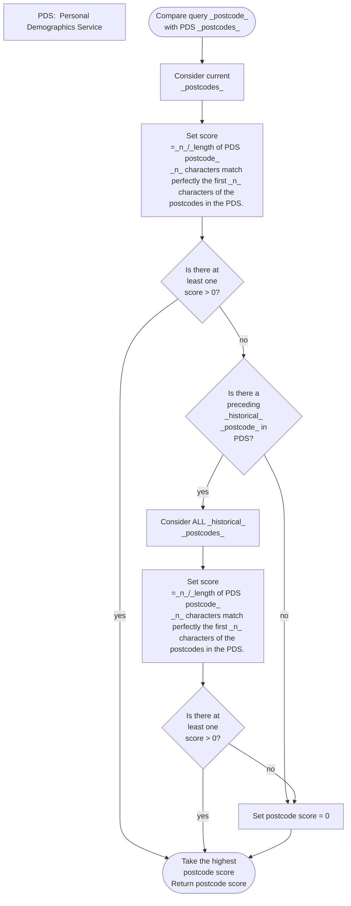

<nav class="toc numbered-toc">
<h2 id="table-of-contents">Table of Contents</h2>

1. TOC
{:toc}

</nav>

<article class="numbered-headings">

## Introduction

Matching, in this context, describes the technical details of a query operation in some database system containing person data (like a FHIR Master Patient Index) based on some set of (demographic and other) details about a person.

The input details given are likely to be lacking in many cases (incomplete, wrong etc.), so the matching operation must be such that it produces results even in situations where a high-confidence, deterministic equivalence based on authoritative identification cannot be ascertained.

## The matching operation

The matching operation defined in this specification is based on the [FHIR `$match` operation](https://www.hl7.org/fhir/patient-operation-match.html).

The guidelines for implementing the matching operation are based on the the [Patient Matching section](https://hl7.org/fhir/us/identity-matching/patient-matching.html) of the [Identity-focused FHIR implementation guide](https://hl7.org/fhir/us/identity-matching/).

### Technical details

Technical details for the implementation of the matching operation are specified in the [Data Exchange Standard](https://socialcaredata.github.io/spec/data-exchange).

Technical details of the person input data structure the query is required to find are specified in the [Person Data Standard (Identification)](https://socialcaredata.github.io/spec/person).

#### Note about response from Data Exchange Standard

The Data Exchange Standard mandates a response object that is defined as a single FHIR `Parameters` resource with a boolean `match` parameter and a `contact` parameter which is an "Organization or a ContactPoint".

However The FHIR `$match` operation is defined to return a `SearchSetBundle` out parameter which is defined to "contain a set of Patient records that represent possible matches", later also described as "a bundle containing patient records, ordered from most likely to least likely".

We should probably modify the data exchange standard to follow FHIR more closely. This seems especially important in the case of lower quality (incomplete) match inputs which result in lower confidence query results. In these cases the expected output from the matching operation is an ordered collection of potential matches with their associated confidence scores.

## Scoring Matches

The following match grading system has been adjusted from [section 4.7 of the FHIR implementation guide](https://hl7.org/fhir/us/identity-matching/patient-matching.html#scoring-matches--responders-system-match-output-quality-score) to use only the attributes present in the [Person Data Standard (Identification)](https://socialcaredata.github.io/spec/person):

|  Quality  | Score | Element(s) Matching in Responder’s System                                |
|:---------:|:-----:|--------------------------------------------------------------------------|
|    Best   |  .99  | Identifier System & Identifier Value                                     |
|  Superior |   .8  | Given Name(s) & Family Name & Date of Birth & Address line & Postal Code |
|           |       | Given Name(s) & Family Name & Date of Birth & Address line & City        |
| Very Good |   .7  | Given Name(s) & Family Name & Date of Birth & Postal Code                |
|    Good   |   .6  | Given Name(s) & Family Name & Date of Birth                              |
{: .table-bordered}

Some attributes from the Person Data Standard are missing from this table and should probably be considered as well:

- UPRN
- USRN
- Preferred Name(s)

Gender and sex are not referenced here due to the outcome of conversation with the working group, where participants were wary of the heterogeneity in gender/sex recording between systems.

## Matching Attributes

The following rules will apply to the comparison of individual attributes from request input object with attributes from responding system's data:

### Identifiers

If the Identifier System used by an Identifier has an associated/prescribed normalisation procedure then apply that normalisation procedure to the Identifier Value. Otherwise apply the following default normalisation procedure: `remove_whitespace(ltrim(rtrim(identifier.value)))`.

### Names

- Should be normalised by
  - mapping/removing hyphens and other punctuation,
  - unifying casing,
  - mapping/removing diacritics and non-English characters,
  - applying for example the soundex algorithm.
  - See figure 7 on page 35 of the `Person_ID` Handbook for an algorithm that calculate name similarity using the Jaro-Winkler distance.
- Map names from the input object to using the [Name mapping CSV from the `Person_ID` Handbook](https://digital.nhs.uk/binaries/content/assets/website-assets/services/mps/name_mapping.csv):

#### Example

| NAME_FIELD  | ORIGINAL_NAME | MAPPED_NAME |
|-------------|---------------|-------------|
| GIVEN_NAME  | STEFANIE      | STEPHANIE   |
| GIVEN_NAME  | STEFFIE       | STEPHANIE   |
| GIVEN_NAME  | STEFFY        | STEPHANIE   |
| GIVEN_NAME  | STEPHANY      | STEPHANIE   |
| FAMILY_NAME | SMITHE        | SMITH       |
| FAMILY_NAME | SMYTHE        | SMITH       |
| FAMILY_NAME | SMYTH         | SMITH       |
{: .table-bordered}

### Date of Birth

Dates should be normalized and compared in a probabilistic manner as examplified by table 1 on page 32 of the `Person_ID` Handbook:

| Condition                                 | Score |
|-------------------------------------------|------:|
| Match on YYYYMMDD                         |   100 |
| Match on MM and DD only                   |    66 |
| Match on YYYY and MM only                 |    66 |
| Match on YYYY and DD only                 |    66 |
| Match on YYYY and MMDD transposed matches |    66 |
| Match on YYYY only                        |    33 |
| All other states                          |     0 |
{: .table-bordered}

### Postcode

Taking into account the structure of UK postcodes with outward code denoting a large region and inward code denoting a specific smaller region, consider a algorithm like that of figure 6 on page 34 of the `Person_ID` Handbook:

## NHS Personal Demographics Service flow diagram

## Related documents
- [Patient Matching](https://hl7.org/fhir/us/identity-matching/patient-matching.html) (Interoperable Digital Identity and Patient Matching, Identity-focused FHIR implementation guide, HL7)
- [The `Person_ID` Handbook](https://digital.nhs.uk/services/personal-demographics-service/master-person-service/the-person_id-handbook) (NHS England Digital)
- [Patient EMPI Match](https://simplifier.net/guide/ca-on-pcr-r4-query-iguide-v2.0/patientempimatch?version=current) (Provincial Client Registry (PCR) HL7 FHIR® Implementation Guide v2.0.0)
